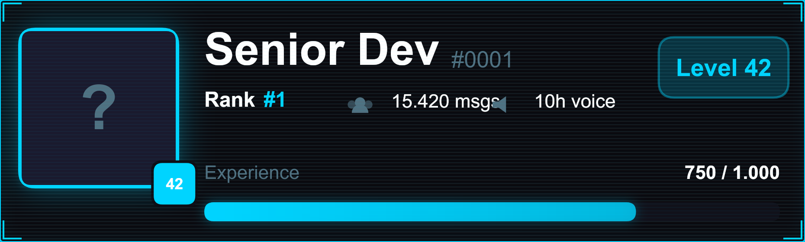
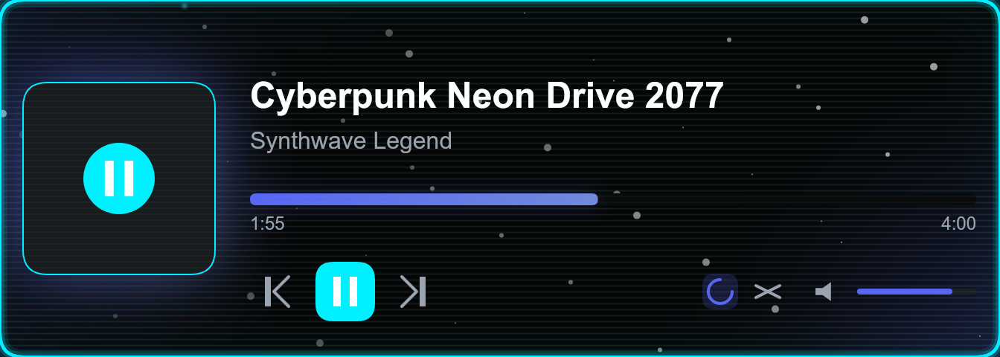
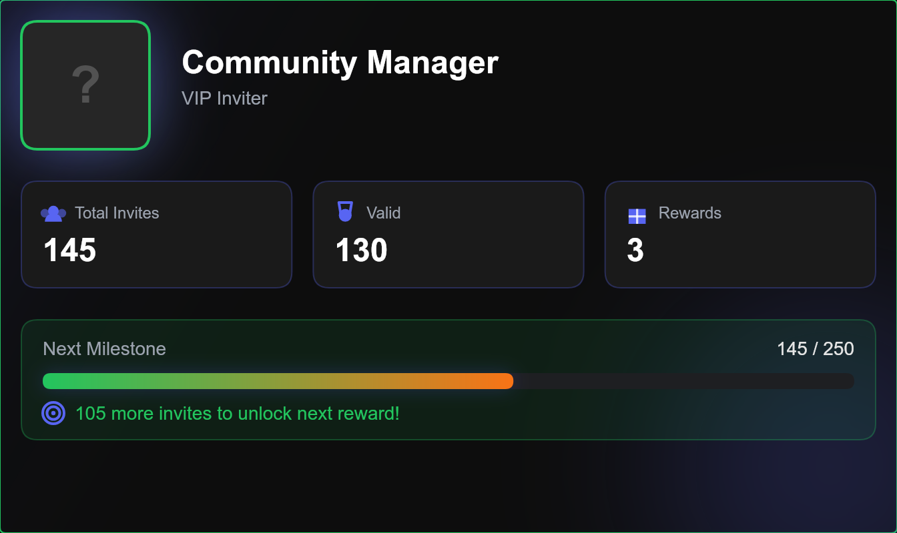

# @reformlabs/modular


`@reformlabs/modular` is a **production-grade, high-performance** canvas rendering engine specifically built for Discord card generation. Unlike generic canvas wrappers, it implements a professional **Design-to-Code pipeline** that separates data logic from visual presentation.

## ✨ Key Features

- 🚀 **Extreme Performance**: Built on top of `@napi-rs/canvas` for native-speed rendering.
- 🎨 **Token-Based Styling**: Change the entire look of your cards by switching a single theme ID.
- 🧠 **Fluent Builder API**: Highly intuitive, chainable methods for creating Rank, Music, Profile, and Leaderboard cards.
- 💎 **Pixel-Perfect Scaling**: Supports DPI up to 4x for crystal clear images on retina displays.
- 🧩 **Extensible Architecture**: Easily create custom components and layouts using our JSON-based DSL.
- 🛡️ **Type Safe**: First-class TypeScript support with exhaustive definitions.

## 🚀 The 2-Minute Quick Start

```bash
npm install @reformlabs/modular
```

```javascript
import { RankCard } from '@reformlabs/modular';

const buffer = await new RankCard()
    .setUsername('Senior Developer')
    .setAvatar('https://github.com/manymq.png')
    .setTheme('neon-tech')
    .render();
```

## 🗺️ Documentation Map

To get the most out of ReformLabs Modular, follow our curated documentation path:

### 🏁 Level 1: Getting Started
1. **[Installation Guide](./docs/getting-started/installation.md)** - Setting up the native environment.
2. **[Quick Start](./docs/getting-started/quick-start.md)** - Generate your first card in 2 minutes.
3. **[First Card In-Depth](./docs/getting-started/first-card.md)** - Understanding the builder anatomy.

### 🧠 Level 2: Core Concepts
4. **[The Theme System](./docs/core-concepts/themes.md)** - Tokens, colors, and effects.
5. **[Render Pipeline](./docs/core-concepts/render-pipeline.md)** - How a card goes from data to pixels.
6. **[Card Builders](./docs/core-concepts/builders.md)** - Mastering specialized builders.
7. **[System Architecture](./docs/core-concepts/system-architecture.md)** - The high-level design.

### 📑 Level 3: API Reference
8. **[CardBuilder API](./docs/api/card-builder.md)** - Full method reference.
9. **[Theme Engine API](./docs/api/theme-engine.md)** - Registering and managing themes.
10. **[Render Engine API](./docs/api/render-engine.md)** - Low-level canvas controls.

### 🛠️ Level 4: Advanced Guides
11. **[Design System Mapping](./docs/design-system/assets-mapping.md)** - Bridging Figma and Canvas.
12. **[Custom Theme Creation](./docs/guides/creating-custom-theme.md)** - Building your own brand.
13. **[Performance & Scaling](./docs/guides/performance.md)** - Handling millions of renders.

## 🖼️ Examples Gallery

| Rank Card | Music Card | Profile Card |
| :---: | :---: | :---: |
|  |  |  |
| `cyberpunk` | `neon-tech` | `glass-modern` |

Explore the **[Full Examples Overview](./docs/examples/examples-overview.md)** for more.

## ❤️ Contributing
We welcome contributions! Please see our architecture guide before submitting a PR.

## 📜 License
MIT
