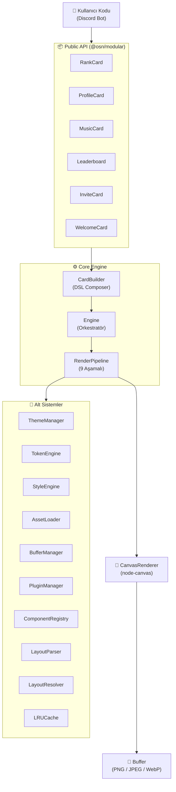
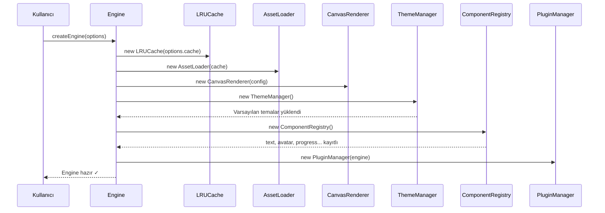
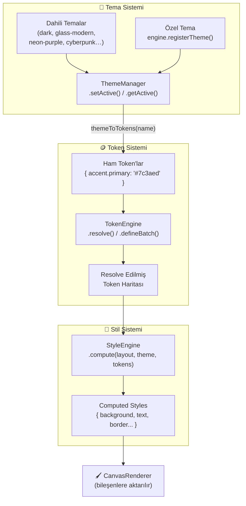
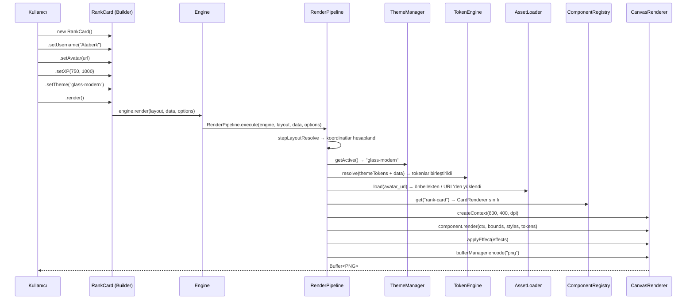
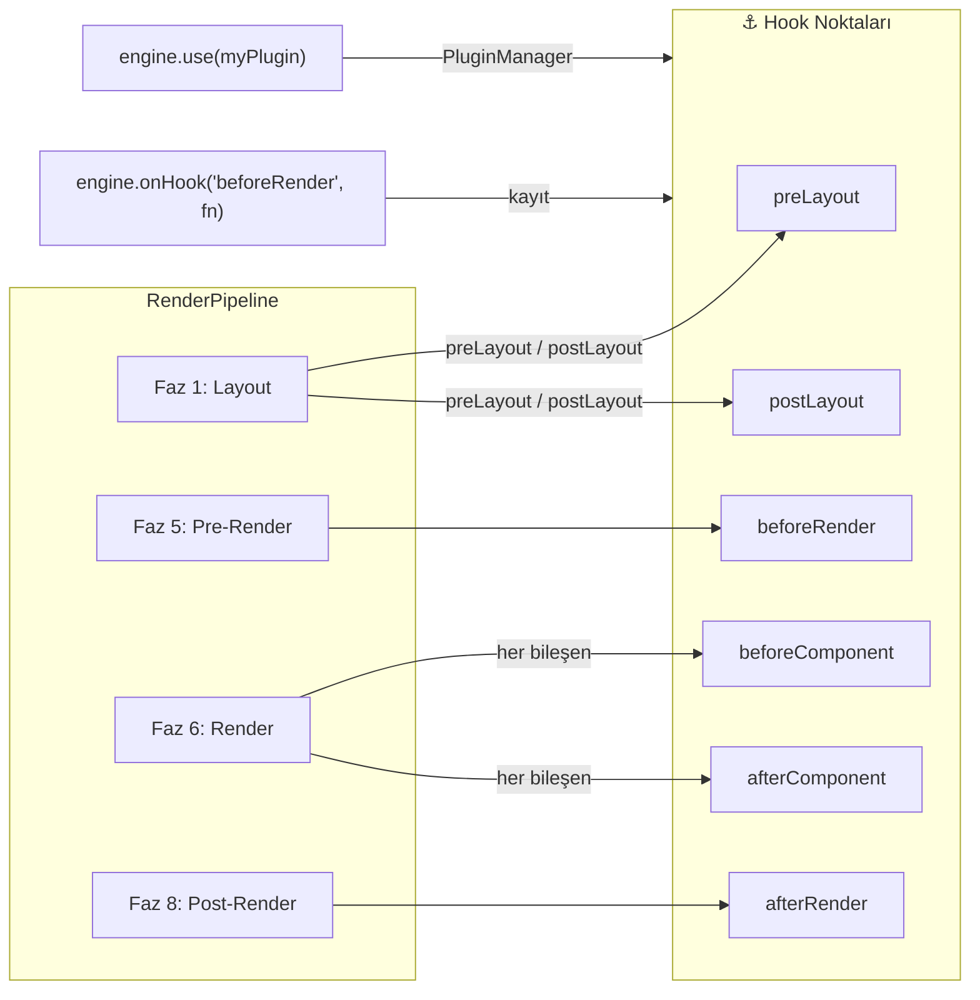
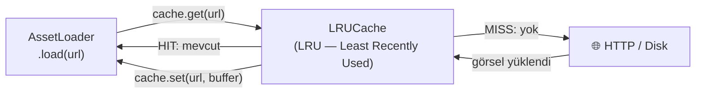
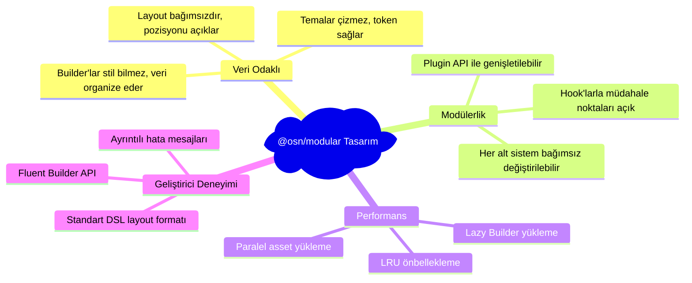

# System Architecture

Bu belge, `@osn/modular` motorunun tasarım felsefesini, bileşen hiyerarşisini ve verilerin girişten çıkışa kadar nasıl aktığını açıklar.

---

## 1. Genel Bakış

`@osn/modular`, Discord botları için **piksel mükemmellikte kart görselleri** üretmek amacıyla tasarlanmış, Node.js üzerinde çalışan modüler bir canvas render motorudur. Sistem üç temel katmandan oluşur:

| Katman | Sorumluluk |
|---|---|
| **Public API** | Kullanıcının etkileşim kurduğu Builder sınıfları ve `createEngine` fabrikası |
| **Core Engine** | Tüm alt sistemleri koordine eden orkestratör |
| **Canvas Pipeline** | Gerçek çizim, stil ve tema işlemlerini yapan düşük seviyeli katman |

---

## 2. Üst Düzey Mimari

---

## 3. Engine — Alt Sistem Başlatma Sırası

`Engine` nesnesi oluşturulduğunda, bağımlılıkları doğru sırada enjekte ederek tüm alt sistemleri hazır hale getirir:

---

## 4. RenderPipeline — 9 Aşamalı Akış

Bir `.render()` çağrısı yapıldığında, `RenderPipeline` aşağıdaki aşamaları sırasıyla çalıştırır:

```mermaid
flowchart LR
    START(["🟢 render(layout, data, options)"])

    P1["📐 Faz 1\nLayout Resolve\nAbsolut koordinat\nhesabı"]
    P2["🎨 Faz 2\nToken Resolve\nTema + değişken\nbirleştirme"]
    P3["💅 Faz 3\nStyle Resolve\nToken → görsel stil\ndönüşümü"]
    P4["🖼️ Faz 4\nAsset Preload\nGörsel ve font\nön yükleme"]
    P5["🔌 Faz 5\nPre-Render Hooks\nPlugin çalıştırma\n(beforeRender)"]
    P6["✏️ Faz 6\nComponent Render\nHer bileşen\ncanvas'a çizilir"]
    P7["✨ Faz 7\nFX Pass\nGlobal efektler\n(glow, scanline…)"]
    P8["🔌 Faz 8\nPost-Render Hooks\nPlugin çalıştırma\n(afterRender)"]
    P9["📦 Faz 9\nExport Encode\nPNG/JPEG/WebP\nbuffer çıktısı"]

    END(["🏁 Buffer döndürülür"])

    START --> P1 --> P2 --> P3 --> P4 --> P5 --> P6 --> P7 --> P8 --> P9 --> END
```

### Faz Detayları

| # | Faz | Kaynak Sınıf | Çıktı |
|---|---|---|---|
| 1 | Layout Resolve | `LayoutParser` + `LayoutResolver` | Resolve edilmiş koordinat ağacı |
| 2 | Token Resolve | `TokenEngine` + `ThemeManager` | Birleştirilmiş token haritası |
| 3 | Style Resolve | `StyleEngine` | Hesaplanmış stil objesi |
| 4 | Asset Preload | `AssetLoader` + `LRUCache` | Önbelleğe alınmış görseller |
| 5 | Pre-Render | `Engine.hooks.beforeRender` | — |
| 6 | Component Render | `ComponentRegistry` + `CanvasRenderer` | Çizilmiş canvas |
| 7 | FX Pass | `CanvasRenderer.applyEffect` | Post-process canvas |
| 8 | Post-Render | `Engine.hooks.afterRender` | — |
| 9 | Export Encode | `BufferManager` | `Buffer` (PNG/JPEG/WebP) |

---

## 5. Tema Sistemi Veri Akışı

Tema sistemi **veri odaklı** (data-driven) bir yaklaşım izler. Temalar çizmez; yalnızca token değerleri sağlar.

---

## 6. Builder → Engine → Pipeline Çağrı Zinciri

Kullanıcının `new RankCard()` ile başladığı akıştan `Buffer` döndürülmesine kadar tam zincir:

---

## 7. Bileşen Ağacı (Component Registry)

`ComponentRegistry`, tüm çizilebilir bileşenleri isimle depolar. `RenderPipeline`, layout ağacındaki her node için ilgili bileşen sınıfını registry'den alır.

---

## 8. Plugin & Hook Sistemi

Plugin'ler ve Hook'lar, render döngüsünün belirli noktalarına müdahale etmenizi sağlar.

---

## 9. Önbellek Mimarisi

`LRUCache`, tekrarlayan avatar URL'lerini ve fontları bellekte tutar; gereksiz ağ isteklerini önler.

- **Varsayılan davranış**: Aynı avatar URL'si birden fazla kez render edildiğinde yalnızca ilk seferinde indirilir.
- **Temizleme**: `engine.clearCache()` ile tamamen sıfırlanabilir.
- **İstatistik**: `engine.getCacheStats()` → `{ size, maxSize }`

---

## 10. Tasarım Prensipleri

---

## Sonraki Adımlar

- [Render Pipeline Detayları →](./render-pipeline.md)
- [Builder API →](./builders.md)
- [Tema Sistemi →](./themes.md)
- [Özel Tema Oluşturma →](../guides/creating-custom-theme.md)
- [Performans Kılavuzu →](../guides/performance.md)
