```mermaid
sequenceDiagram
    participant U as User
    participant B as RankCard (Builder)
    participant E as Engine
    participant RP as RenderPipeline
    participant TM as ThemeManager
    participant TE as TokenEngine
    participant AL as AssetLoader
    participant CR as ComponentRegistry
    participant CV as CanvasRenderer

    U->>B: new RankCard()
    U->>B: .setUsername("Ataberk")
    U->>B: .setAvatar(url)
    U->>B: .setXP(750, 1000)
    U->>B: .setTheme("glass-modern")
    U->>B: .render()

    B->>E: engine.render(layout, data, options)
    E->>RP: RenderPipeline.execute(engine, layout, data, options)

    RP->>RP: stepLayoutResolve → coordinates computed
    RP->>TM: getActive() → "glass-modern"
    RP->>TE: resolve(themeTokens + data) → tokens merged
    RP->>AL: load(avatar_url) → loaded from cache / URL
    RP->>CR: get("rank-card") → CardRenderer class
    RP->>CV: createContext(800, 400, dpi)
    RP->>CV: component.render(ctx, bounds, styles, tokens)
    RP->>CV: applyEffect(effects)
    RP->>CV: bufferManager.encode("png")

    CV-->>U: Buffer<PNG>
```

# System Architecture

This document describes the design philosophy, component hierarchy, and end-to-end data flow of the `@osn/modular` engine.

---

## 1. Overview

`@osn/modular` is a modular canvas rendering engine running on Node.js, designed to produce **pixel-perfect card images** for Discord bots. The system is composed of three primary layers:

| Layer | Responsibility |
|---|---|
| **Public API** | Builder classes and the `createEngine` factory that users interact with |
| **Core Engine** | Orchestrator that coordinates all subsystems |
| **Canvas Pipeline** | Low-level layer responsible for actual drawing, styling, and theming |

---

## 2. High-Level Architecture

```mermaid
graph TD
    USER["👤 User Code\n(Discord Bot)"]

    subgraph PUBLIC_API["📦 Public API (@osn/modular)"]
        direction LR
        RC["RankCard"]
        PC["ProfileCard"]
        MC["MusicCard"]
        LC["Leaderboard"]
        IC["InviteCard"]
        WC["WelcomeCard"]
    end

    subgraph CORE["⚙️ Core Engine"]
        ENGINE["Engine\n(Orchestrator)"]
        PIPELINE["RenderPipeline\n(9 Phases)"]
        BUILDER["CardBuilder\n(DSL Composer)"]
    end

    subgraph SUBSYSTEMS["🔧 Subsystems"]
        TM["ThemeManager"]
        TE["TokenEngine"]
        SE["StyleEngine"]
        AL["AssetLoader"]
        BM["BufferManager"]
        PM["PluginManager"]
        CR["ComponentRegistry"]
        LP["LayoutParser"]
        LR["LayoutResolver"]
        LRU["LRUCache"]
    end

    CANVAS["🎨 CanvasRenderer\n(node-canvas)"]
    OUTPUT["📁 Buffer\n(PNG / JPEG / WebP)"]

    USER --> PUBLIC_API
    PUBLIC_API --> BUILDER
    BUILDER --> ENGINE
    ENGINE --> PIPELINE
    PIPELINE --> SUBSYSTEMS
    PIPELINE --> CANVAS
    CANVAS --> OUTPUT
```

---

## 3. Engine — Subsystem Initialization Order

When the `Engine` object is instantiated, it initializes all subsystems by injecting their dependencies in the correct order:

---

## 4. RenderPipeline — 9-Phase Flow

When a `.render()` call is made, the `RenderPipeline` executes the following phases in sequence:

```mermaid
flowchart LR
    START(["🟢 render(layout, data, options)"])

    P1["📐 Phase 1\nLayout Resolve\nCompute absolute\ncoordinates"]
    P2["🎨 Phase 2\nToken Resolve\nMerge theme +\nvariables"]
    P3["💅 Phase 3\nStyle Resolve\nToken → visual\nstyle mapping"]
    P4["🖼️ Phase 4\nAsset Preload\nLoad images\nand fonts"]
    P5["🔌 Phase 5\nPre-Render Hooks\nRun plugins\n(beforeRender)"]
    P6["✏️ Phase 6\nComponent Render\nDraw each component\nonto canvas"]
    P7["✨ Phase 7\nFX Pass\nGlobal effects\n(glow, scanline…)"]
    P8["🔌 Phase 8\nPost-Render Hooks\nRun plugins\n(afterRender)"]
    P9["📦 Phase 9\nExport Encode\nPNG/JPEG/WebP\nbuffer output"]

    END(["🏁 Buffer returned"])

    START --> P1 --> P2 --> P3 --> P4 --> P5 --> P6 --> P7 --> P8 --> P9 --> END
```

### Phase Details

| # | Phase | Source Class | Output |
|---|---|---|---|
| 1 | Layout Resolve | `LayoutParser` + `LayoutResolver` | Resolved coordinate tree |
| 2 | Token Resolve | `TokenEngine` + `ThemeManager` | Merged token map |
| 3 | Style Resolve | `StyleEngine` | Computed style object |
| 4 | Asset Preload | `AssetLoader` + `LRUCache` | Cached images & fonts |
| 5 | Pre-Render | `Engine.hooks.beforeRender` | — |
| 6 | Component Render | `ComponentRegistry` + `CanvasRenderer` | Drawn canvas |
| 7 | FX Pass | `CanvasRenderer.applyEffect` | Post-processed canvas |
| 8 | Post-Render | `Engine.hooks.afterRender` | — |
| 9 | Export Encode | `BufferManager` | `Buffer` (PNG/JPEG/WebP) |

---

## 5. Theme System Data Flow

The theme system follows a **data-driven** approach. Themes do not draw anything; they only supply token values.

```mermaid
flowchart TD
    subgraph THEME_SYS["🎨 Theme System"]
        BUILTIN["Built-in Themes\n(dark, glass-modern,\nneon-purple, cyberpunk…)"]
        CUSTOM["Custom Theme\nengine.registerTheme()"]
        TM2["ThemeManager\n.setActive() / .getActive()"]
    end

    subgraph TOKEN_SYS["🪙 Token System"]
        RAW["Raw Tokens\n{ accent.primary: '#7c3aed' }"]
        TE2["TokenEngine\n.resolve() / .defineBatch()"]
        RESOLVED["Resolved\nToken Map"]
    end

    subgraph STYLE_SYS["💅 Style System"]
        SE2["StyleEngine\n.compute(layout, theme, tokens)"]
        STYLES["Computed Styles\n{ background, text, border... }"]
    end

    RENDERER["🖌️ CanvasRenderer\n(passed to components)"]

    BUILTIN --> TM2
    CUSTOM --> TM2
    TM2 -->|"themeToTokens(name)"| RAW
    RAW --> TE2
    TE2 --> RESOLVED
    RESOLVED --> SE2
    SE2 --> STYLES
    STYLES --> RENDERER
```

---

## 6. Builder → Engine → Pipeline Call Chain

The complete chain from the user's `new RankCard()` call all the way to the returned `Buffer`:

---

## 7. Component Tree (Component Registry)

`ComponentRegistry` stores all drawable components by name. For each node in the layout tree, `RenderPipeline` looks up the corresponding component class from the registry.

```mermaid
graph TD
    REG["🗂️ ComponentRegistry"]

    REG --> UI["UI Components"]
    REG --> CARD["Card Controllers"]

    UI --> T["text\n→ TextComponent"]
    UI --> AV["avatar\n→ AvatarComponent"]
    UI --> PR["progress\n→ ProgressComponent"]
    UI --> ME["media / image / album-art / banner\n→ MediaComponent"]
    UI --> CO["container / box / level-box / stat-box\n→ ContainerComponent"]

    CARD --> RK["rank-card → CardRenderer"]
    CARD --> MU["music-card → CardRenderer"]
    CARD --> LB["leaderboard-card → CardRenderer"]
    CARD --> IV["invite-card → CardRenderer"]
    CARD --> PF["profile-card → CardRenderer"]
    CARD --> WL["welcome-card → CardRenderer"]
```

---

## 8. Plugin & Hook System

Plugins and hooks allow you to intercept the render cycle at specific points.

---

## 9. Cache Architecture

`LRUCache` keeps repeatedly used avatar URLs and fonts in memory, preventing unnecessary network requests.

```mermaid
flowchart LR
    AL2["AssetLoader\n.load(url)"]
    CACHE["LRUCache\n(LRU — Least Recently Used)"]
    NET["🌐 HTTP / Disk"]

    AL2 -->|"cache.get(url)"| CACHE
    CACHE -->|"HIT: exists"| AL2
    CACHE -->|"MISS: not found"| NET
    NET -->|"asset loaded"| CACHE
    CACHE -->|"cache.set(url, buffer)"| AL2
```

- **Default behaviour**: When the same avatar URL is rendered multiple times, it is downloaded only on the first request.
- **Clearing**: Can be fully reset via `engine.clearCache()`.
- **Stats**: `engine.getCacheStats()` → `{ size, maxSize }`

---

## 10. Design Principles

---

## Next Steps

- [Render Pipeline Details →](./render-pipeline.md)
- [Builder API →](./builders.md)
- [Theme System →](./themes.md)
- [Creating a Custom Theme →](../guides/creating-custom-theme.md)
- [Performance Guide →](../guides/performance.md)
