# System Architecture

Bu belge, `@osn/modular` motorunun tasarım felsefesini, bileşen hiyerarşisini ve verilerin girişten çıkışa kadar nasıl aktığını açıklar.

---

## 1. Genel Bakış

`@osn/modular`, Discord botları için **piksel mükemmellikte kart görselleri** üretmek amacıyla tasarlanmış, Node.js üzerinde çalışan modüler bir canvas render motorudur. Sistem üç temel katmandan oluşur:

| Katman | Sorumluluk |
|---|---|
| **Public API** | Kullanıcının etkileşim kurduğu Builder sınıfları ve `createEngine` fabrikası |
| **Core Engine** | Tüm alt sistemleri koordine eden orkestratör |
| **Canvas Pipeline** | Gerçek çizim, stil ve tema işlemlerini yapan düşük seviyeli katman |

---

## 2. Üst Düzey Mimari

```mermaid
graph TD
    USER["👤 User Code\n(Discord Bot)"]

    subgraph PUBLIC_API["📦 Public API (@osn/modular)"]
        direction LR
        RC["RankCard"]
        PC["ProfileCard"]
        MC["MusicCard"]
        LC["Leaderboard"]
        IC["InviteCard"]
        WC["WelcomeCard"]
    end

    subgraph CORE["⚙️ Core Engine"]
        ENGINE["Engine\n(Orchestrator)"]
        PIPELINE["RenderPipeline\n(9 Phases)"]
        BUILDER["CardBuilder\n(DSL Composer)"]
    end

    subgraph SUBSYSTEMS["🔧 Subsystems"]
        TM["ThemeManager"]
        TE["TokenEngine"]
        SE["StyleEngine"]
        AL["AssetLoader"]
        BM["BufferManager"]
        PM["PluginManager"]
        CR["ComponentRegistry"]
        LP["LayoutParser"]
        LR["LayoutResolver"]
        LRU["LRUCache"]
    end

    CANVAS["🎨 CanvasRenderer\n(node-canvas)"]
    OUTPUT["📁 Buffer\n(PNG / JPEG / WebP)"]

    USER --> PUBLIC_API
    PUBLIC_API --> BUILDER
    BUILDER --> ENGINE
    ENGINE --> PIPELINE
    PIPELINE --> SUBSYSTEMS
    PIPELINE --> CANVAS
    CANVAS --> OUTPUT
```

---

## 3. Engine — Alt Sistem Başlatma Sırası

`Engine` nesnesi oluşturulduğunda, bağımlılıkları doğru sırada enjekte ederek tüm alt sistemleri hazır hale getirir:

---

## 4. RenderPipeline — 9 Aşamalı Akış

Bir `.render()` çağrısı yapıldığında, `RenderPipeline` aşağıdaki aşamaları sırasıyla çalıştırır:

```mermaid
flowchart LR
    START(["🟢 render(layout, data, options)"])

    P1["📐 Phase 1\nLayout Resolve\nCompute absolute\ncoordinates"]
    P2["🎨 Phase 2\nToken Resolve\nMerge theme +\nvariables"]
    P3["💅 Phase 3\nStyle Resolve\nToken → visual\nstyle mapping"]
    P4["🖼️ Phase 4\nAsset Preload\nLoad images\nand fonts"]
    P5["🔌 Phase 5\nPre-Render Hooks\nRun plugins\n(beforeRender)"]
    P6["✏️ Phase 6\nComponent Render\nDraw each component\nonto canvas"]
    P7["✨ Phase 7\nFX Pass\nGlobal effects\n(glow, scanline…)"]
    P8["🔌 Phase 8\nPost-Render Hooks\nRun plugins\n(afterRender)"]
    P9["📦 Phase 9\nExport Encode\nPNG/JPEG/WebP\nbuffer output"]

    END(["🏁 Buffer returned"])

    START --> P1 --> P2 --> P3 --> P4 --> P5 --> P6 --> P7 --> P8 --> P9 --> END
```

### Faz Detayları

| # | Faz | Kaynak Sınıf | Çıktı |
|---|---|---|---|
| 1 | Layout Resolve | `LayoutParser` + `LayoutResolver` | Resolve edilmiş koordinat ağacı |
| 2 | Token Resolve | `TokenEngine` + `ThemeManager` | Birleştirilmiş token haritası |
| 3 | Style Resolve | `StyleEngine` | Hesaplanmış stil objesi |
| 4 | Asset Preload | `AssetLoader` + `LRUCache` | Önbelleğe alınmış görseller |
| 5 | Pre-Render | `Engine.hooks.beforeRender` | — |
| 6 | Component Render | `ComponentRegistry` + `CanvasRenderer` | Çizilmiş canvas |
| 7 | FX Pass | `CanvasRenderer.applyEffect` | Post-process canvas |
| 8 | Post-Render | `Engine.hooks.afterRender` | — |
| 9 | Export Encode | `BufferManager` | `Buffer` (PNG/JPEG/WebP) |

---

## 5. Tema Sistemi Veri Akışı

Tema sistemi **veri odaklı** (data-driven) bir yaklaşım izler. Temalar çizmez; yalnızca token değerleri sağlar.

```mermaid
flowchart TD
    subgraph THEME_SYS["🎨 Theme System"]
        BUILTIN["Built-in Themes\n(dark, glass-modern,\nneon-purple, cyberpunk…)"]
        CUSTOM["Custom Theme\nengine.registerTheme()"]
        TM2["ThemeManager\n.setActive() / .getActive()"]
    end

    subgraph TOKEN_SYS["🪙 Token System"]
        RAW["Raw Tokens\n{ accent.primary: '#7c3aed' }"]
        TE2["TokenEngine\n.resolve() / .defineBatch()"]
        RESOLVED["Resolved\nToken Map"]
    end

    subgraph STYLE_SYS["💅 Style System"]
        SE2["StyleEngine\n.compute(layout, theme, tokens)"]
        STYLES["Computed Styles\n{ background, text, border... }"]
    end

    RENDERER["🖌️ CanvasRenderer\n(passed to components)"]

    BUILTIN --> TM2
    CUSTOM --> TM2
    TM2 -->|"themeToTokens(name)"| RAW
    RAW --> TE2
    TE2 --> RESOLVED
    RESOLVED --> SE2
    SE2 --> STYLES
    STYLES --> RENDERER
```

---

## 6. Builder → Engine → Pipeline Çağrı Zinciri

Kullanıcının `new RankCard()` ile başladığı akıştan `Buffer` döndürülmesine kadar tam zincir:

```mermaid
sequenceDiagram
    participant U as User
    participant B as RankCard (Builder)
    participant E as Engine
    participant RP as RenderPipeline
    participant TM as ThemeManager
    participant TE as TokenEngine
    participant AL as AssetLoader
    participant CR as ComponentRegistry
    participant CV as CanvasRenderer

    U->>B: new RankCard()
    U->>B: .setUsername("Ataberk")
    U->>B: .setAvatar(url)
    U->>B: .setXP(750, 1000)
    U->>B: .setTheme("glass-modern")
    U->>B: .render()

    B->>E: engine.render(layout, data, options)
    E->>RP: RenderPipeline.execute(engine, layout, data, options)

    RP->>RP: stepLayoutResolve → coordinates computed
    RP->>TM: getActive() → "glass-modern"
    RP->>TE: resolve(themeTokens + data) → tokens merged
    RP->>AL: load(avatar_url) → loaded from cache / URL
    RP->>CR: get("rank-card") → CardRenderer class
    RP->>CV: createContext(800, 400, dpi)
    RP->>CV: component.render(ctx, bounds, styles, tokens)
    RP->>CV: applyEffect(effects)
    RP->>CV: bufferManager.encode("png")

    CV-->>U: Buffer<PNG>
```

---

## 7. Bileşen Ağacı (Component Registry)

`ComponentRegistry`, tüm çizilebilir bileşenleri isimle depolar. `RenderPipeline`, layout ağacındaki her node için ilgili bileşen sınıfını registry'den alır.

---

## 8. Plugin & Hook Sistemi

Plugin'ler ve Hook'lar, render döngüsünün belirli noktalarına müdahale etmenizi sağlar.

---

## 9. Önbellek Mimarisi

`LRUCache`, tekrarlayan avatar URL'lerini ve fontları bellekte tutar; gereksiz ağ isteklerini önler.

- **Varsayılan davranış**: Aynı avatar URL'si birden fazla kez render edildiğinde yalnızca ilk seferinde indirilir.
- **Temizleme**: `engine.clearCache()` ile tamamen sıfırlanabilir.
- **İstatistik**: `engine.getCacheStats()` → `{ size, maxSize }`

---

## 10. Tasarım Prensipleri

---

## Sonraki Adımlar

- [Render Pipeline Detayları →](./render-pipeline.md)
- [Builder API →](./builders.md)
- [Tema Sistemi →](./themes.md)
- [Özel Tema Oluşturma →](../guides/creating-custom-theme.md)
- [Performans Kılavuzu →](../guides/performance.md)
