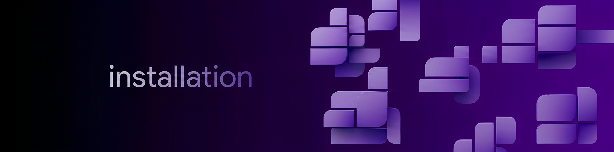

# Getting Started with Modular

<div align="center">

**A production-grade Node.js canvas rendering engine for Discord cards**

[](https://nodejs.org)
[](https://discord.js.org)
[](LICENSE)

</div>

Welcome to Modular! This guide will help you get started with our production-grade Node.js canvas rendering engine for Discord cards.

<div align="center">



*Easy installation with npm*

</div>

## Table of Contents

- [📦 Installation](#-installation)
- [🛠️ Prerequisites](#️-prerequisites)
- [🚀 Your First Card](#-your-first-card)
- [🎮 Creating Different Card Types](#-creating-different-card-types)
- [🎨 Customizing with Themes](#-customizing-with-themes)
- [🧬 Using Design Tokens](#-using-design-tokens)
- [🔧 Discord.js Integration](#-discordjs-integration)
- [📤 Sending Cards to Discord](#-sending-cards-to-discord)
- [⚙️ Configuration Options](#️-configuration-options)
- [❓ Common Questions](#-common-questions)

---

## 📦 Installation

### Using npm

```bash
npm install modular
```

### Using yarn

```bash
yarn add modular
```

### Using pnpm

```bash
pnpm add modular
```

### Verifying Installation

```javascript
const { createEngine } = require('modular');
console.log('Modular version:', require('modular/package.json').version);
```

<div align="center">


*Comprehensive documentation available*

</div>

---

## 🛠️ Prerequisites

Before you begin, make sure you have:

- **Node.js 18.0.0 or higher**
- **A Discord bot** (for Discord integration)
- **Basic JavaScript/TypeScript knowledge**

### Node.js Version Check

```bash
node --version
# Should be v18.0.0 or higher
```

### Setting Up a Discord Bot

1. Go to [Discord Developer Portal](https://discord.com/developers/applications)
2. Create a new application
3. Create a bot user
4. Copy your bot token
5. Invite the bot to your server

---

## 🚀 Your First Card

Let's create your first card step by step.

<div align="center">


*Create stunning rank cards*

</div>

### Step 1: Initialize the Engine

```javascript
const { createEngine } = require('modular');

// Create an engine instance with default options
const engine = createEngine();

// Or with custom options
const engine = createEngine({
  dpi: 2,                  // Render quality (1-4)
  cache: { maxSize: 100 }, // Asset cache size
  debug: false            // Enable debug logging
});
```

### Step 2: Create a Card

```javascript
const { createEngine } = require('modular');

const engine = createEngine();

// Create a rank card
const rankCard = engine.createRankCard()
  .setUser(user)
  .setStats({
    level: 50,
    xp: 7500,
    maxXp: 10000,
    rank: 5,
    totalXp: 150000
  });
```

### Step 3: Render and Send

```javascript
// Get as a buffer (PNG)
const buffer = await rankCard.toBuffer();

// Send to Discord
await rankCard.send(interaction);
```

---

## 🎮 Creating Different Card Types

### Rank Card

Displays user level, XP, and rank information.

```javascript
const rankCard = engine.createRankCard()
  .setUser(user)
  .setGuild(guild)
  .setTheme('cyberpunk')
  .setStats({
    level: 50,
    xp: 7500,
    maxXp: 10000,
    rank: 5,
    totalXp: 150000
  })
  .setBackground({
    type: 'gradient',
    colors: ['#1a1a2e', '#16213e'],
    direction: 'horizontal'
  });

await rankCard.send(interaction);
```

### Music Card

Displays current playing track information.

```javascript
const musicCard = engine.createMusicCard()
  .setUser(user)
  .setTrack({
    title: 'Blinding Lights',
    artist: 'The Weeknd',
    album: 'After Hours',
    coverUrl: 'https://example.com/cover.jpg',
    duration: 200,
    position: 45
  })
  .setTheme('neon')
  .setProgressColor('#00ffcc');

await musicCard.send(interaction);
```

### Leaderboard Card

Displays server rankings.

```javascript
const leaderboardCard = engine.createLeaderboardCard()
  .setGuild(guild)
  .setTheme('midnight')
  .setEntries([
    { rank: 1, user: user1, xp: 150000, level: 75 },
    { rank: 2, user: user2, xp: 125000, level: 65 },
    { rank: 3, user: user3, xp: 100000, level: 55 }
  ])
  .setHighlightRank(1);

await leaderboardCard.send(interaction);
```

### Invite Card

Tracks and displays invite statistics.

```javascript
const inviteCard = engine.createInviteCard()
  .setUser(user)
  .setInvites({
    total: 50,
    regular: 30,
    fake: 5,
    leaves: 10,
    bonus: 5
  })
  .setTheme('dark');

await inviteCard.send(interaction);
```

### Profile Card

Displays comprehensive user profile.

```javascript
const profileCard = engine.createProfileCard()
  .setUser(user)
  .setGuild(guild)
  .setTheme('light')
  .setInfo({
    joinDate: '2023-01-15',
    accountAge: '2 years',
    badges: ['Early Adopter', 'Verified']
  })
  .setBackground({
    type: 'image',
    url: 'https://example.com/bg.jpg'
  });

await profileCard.send(interaction);
```

### Welcome Card

Welcome new members to the server.

```javascript
const welcomeCard = engine.createWelcomeCard()
  .setUser(user)
  .setGuild(guild)
  .setTheme('ocean')
  .setMessage('Welcome to our server!')
  .setBackground({
    type: 'gradient',
    colors: ['#667eea', '#764ba2']
  });

await welcomeCard.send(interaction);
```

---

## 🎨 Customizing with Themes

### Using Built-in Themes

<div align="center">


*Multiple theme options available*

</div>

```javascript
// Apply a built-in theme
card.useTheme('cyberpunk');
card.useTheme('neon');
card.useTheme('dark');
card.useTheme('midnight');
card.useTheme('ocean');
card.useTheme('sunset');
```

### Creating Custom Themes

```javascript
const myTheme = {
  name: 'my-custom-theme',
  version: '1.0.0',
  colors: {
    background: '#1a1a2e',
    primary: '#00ffcc',
    secondary: '#ff00ff',
    accent: '#ffff00',
    text: {
      primary: '#ffffff',
      secondary: '#b3b3b3',
      muted: '#666666'
    },
    progress: {
      fill: '#00ffcc',
      background: '#333333'
    }
  },
  fonts: {
    title: 'Montserrat Bold',
    body: 'Inter',
    mono: 'JetBrains Mono'
  },
  effects: {
    glow: true,
    shadow: true,
    gradient: true,
    blur: false
  },
  borderRadius: 16,
  padding: 20
};

// Register the theme
engine.themes.register('custom', myTheme);

// Apply the theme
card.useTheme('custom');
```

### Theme Properties Reference

```typescript
interface Theme {
  name: string;
  version?: string;
  colors: {
    background: string;
    primary: string;
    secondary: string;
    accent: string;
    text: {
      primary: string;
      secondary: string;
      muted: string;
    };
    progress: {
      fill: string;
      background: string;
    };
    border?: string;
    shadow?: string;
  };
  fonts: {
    title: string;
    body: string;
    mono: string;
  };
  effects?: {
    glow?: boolean;
    shadow?: boolean;
    gradient?: boolean;
    blur?: boolean;
    animation?: boolean;
  };
  borderRadius?: number;
  padding?: number;
  spacing?: {
    small: number;
    medium: number;
    large: number;
  };
}
```

---

## 🧬 Using Design Tokens

Design tokens provide granular control over styling.

### Global Token Configuration

```javascript
// Set tokens globally on the engine
engine.tokens.set('card.width', 800);
engine.tokens.set('card.height', 250);
engine.tokens.set('card.background', '#1a1a2e');
engine.tokens.set('card.borderRadius', 16);
engine.tokens.set('card.shadow', '0 4px 6px rgba(0,0,0,0.3)');

engine.tokens.set('text.primary', '#00ffcc');
engine.tokens.set('text.secondary', '#b3b3b3');
engine.tokens.set('text.fontFamily', 'Inter');
engine.tokens.set('text.fontSize', 16);
engine.tokens.set('text.fontWeight', 600);

engine.tokens.set('progress.fill', '#ff00ff');
engine.tokens.set('progress.background', '#333333');
engine.tokens.set('progress.height', 10);
engine.tokens.set('progress.borderRadius', 5);

engine.tokens.set('avatar.size', 80);
engine.tokens.set('avatar.border', '#00ffcc');
engine.tokens.set('avatar.borderWidth', 4);
engine.tokens.set('avatar.shape', 'circle');
```

### Per-Card Token Override

```javascript
// Override tokens for a specific card
card.tokens.set('card.background', '#0a0a0a');
card.tokens.set('text.primary', '#ff00ff');
card.tokens.set('progress.fill', '#ff00ff');
card.tokens.set('avatar.border', '#ff00ff');
```

### All Available Tokens

#### Card Tokens

| Token | Type | Default | Description |
|-------|------|---------|-------------|
| `card.width` | number | 800 | Card width in pixels |
| `card.height` | number | 250 | Card height in pixels |
| `card.background` | string | #1a1a2e | Background color |
| `card.gradient` | object | - | Gradient configuration |
| `card.border` | string | none | Border style |
| `card.borderRadius` | number | 16 | Border radius in pixels |
| `card.shadow` | string | - | CSS box-shadow style |
| `card.padding` | number | 20 | Padding in pixels |

#### Text Tokens

| Token | Type | Default | Description |
|-------|------|---------|-------------|
| `text.primary` | string | #ffffff | Primary text color |
| `text.secondary` | string | #b3b3b3 | Secondary text color |
| `text.muted` | string | #666666 | Muted text color |
| `text.fontFamily` | string | Inter | Font family name |
| `text.fontSize` | number | 16 | Font size in pixels |
| `text.fontWeight` | number | 600 | Font weight (100-900) |
| `text.align` | string | left | Text alignment |

#### Progress Tokens

| Token | Type | Default | Description |
|-------|------|---------|-------------|
| `progress.fill` | string | #00ffcc | Progress bar fill color |
| `progress.background` | string | #333333 | Progress bar background |
| `progress.height` | number | 10 | Progress bar height |
| `progress.borderRadius` | number | 5 | Progress bar radius |

#### Avatar Tokens

| Token | Type | Default | Description |
|-------|------|---------|-------------|
| `avatar.size` | number | 80 | Avatar size in pixels |
| `avatar.border` | string | #00ffcc | Avatar border color |
| `avatar.borderWidth` | number | 4 | Avatar border width |
| `avatar.shape` | string | circle | Avatar shape (circle, square, rounded) |

---

## 🔧 Discord.js Integration

### Setting Up with Discord.js v14

```javascript
const { Client, GatewayIntentBits, SlashCommandBuilder } = require('discord.js');
const { createEngine } = require('modular');

const client = new Client({
  intents: [
    GatewayIntentBits.Guilds,
    GatewayIntentBits.GuildMessages
  ]
});

const engine = createEngine();

// Register slash commands
const rankCommand = new SlashCommandBuilder()
  .setName('rank')
  .setDescription('Show your rank card');

client.on('ready', async () => {
  await client.application.commands.create(rankCommand);
  console.log(`Logged in as ${client.user.tag}`);
});

client.on('interactionCreate', async (interaction) => {
  if (!interaction.isChatInputCommand()) return;

  if (interaction.commandName === 'rank') {
    const card = engine.createRankCard()
      .setUser(interaction.user)
      .setStats({ level: 50, xp: 7500, maxXp: 10000, rank: 5 })
      .setTheme('cyberpunk');

    await card.send(interaction);
  }
});

client.login('YOUR_BOT_TOKEN');
```

---

## 📤 Sending Cards to Discord

### Send as New Message

```javascript
await card.send(interaction);
```

### Reply to Interaction

```javascript
await card.reply(interaction);
```

### Follow-up Message

```javascript
// Regular follow-up
await card.followUp(interaction);

// Ephemeral message (only visible to user)
await card.followUp(interaction, { ephemeral: true });
```

### With Custom Content

```javascript
await card.send(interaction, {
  content: 'Check out your new rank card!',
  ephemeral: true
});
```

---

## ⚙️ Configuration Options

### Engine Options

```javascript
const engine = createEngine({
  // Render quality (higher = better quality, more memory)
  dpi: 2,

  // Cache configuration
  cache: {
    maxSize: 100,       // Maximum cached items
    maxAge: 3600000     // Cache TTL in ms (1 hour default)
  },

  // Enable debug logging
  debug: false,

  // Enable canvas rendering
  canvas: true,

  // Default theme name
  defaultTheme: 'dark',

  // Font configuration
  fonts: {
    default: 'Inter',   // Default font family
    path: './fonts'     // Custom font directory
  }
});
```

### Card Options

```javascript
const card = engine.createRankCard()
  .setOptions({
    width: 800,         // Card width
    height: 250,        // Card height
    format: 'png',      // Output format (png, jpeg)
    quality: 1.0,       // Image quality (0-1)
    background: null,  // Background override
    cache: true         // Enable caching
  });
```

---

## ❓ Common Questions

### How do I change the card size?

```javascript
card.setTokens({
  'card.width': 800,
  'card.height': 250
});
```

### Can I use custom fonts?

```javascript
engine.fonts.register({
  family: 'Montserrat',
  path: './fonts/Montserrat-Regular.ttf'
});

card.setTokens({
  'text.fontFamily': 'Montserrat'
});
```

### How do I add badges to cards?

```javascript
card.setBadges([
  { type: 'online', position: 'top-right' },
  { type: 'verified', position: 'top-left' }
]);
```

### How do I create animated cards?

```javascript
const card = engine.createRankCard()
  .setUser(user)
  .setOptions({
    animation: {
      enabled: true,
      duration: 1000,
      type: 'fade-in'
    }
  });
```

---

## Related Documentation

- [API Reference](api-reference.md) - Complete API documentation
- [Themes](themes.md) - Theme customization guide
- [Output Guide](output-guide.md) - Export and deployment options
- [Rank Cards](rank-cards.md) - Rank card specific documentation
- [Music Cards](music-cards.md) - Music card specific documentation
- [Leaderboard Cards](leaderboard-cards.md) - Leaderboard card documentation
- [Invite Cards](invite-cards.md) - Invite card documentation

<div align="center">


*Get started with Modular today*

</div>
