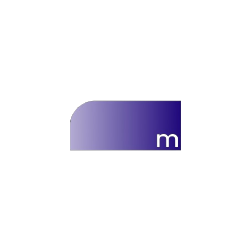

# Music Cards

<div align="center">

**Display current playing track information**

[](music-cards.md)

</div>

Music cards display current playing track information with progress visualization. Perfect for music bots and servers with music features.

<div align="center">



*Beautiful music player cards*

</div>

## Table of Contents

- [Overview](#overview)
- [Basic Usage](#basic-usage)
- [Track Configuration](#track-configuration)
- [Progress Visualization](#progress-visualization)
- [Examples](#examples)
- [Styling Options](#styling-options)

---

## Overview

Music cards provide a visual display of the currently playing track, including:

- Album/track artwork
- Track title and artist
- Album name
- Progress bar with current position
- Duration display
- Volume indicator (optional)

---

## Basic Usage

### Creating a Music Card

```javascript
const { createEngine } = require('modular');

const engine = createEngine();

const musicCard = engine.createMusicCard()
  .setUser(user)
  .setTrack({
    title: 'Blinding Lights',
    artist: 'The Weeknd',
    album: 'After Hours',
    coverUrl: 'https://example.com/cover.jpg',
    duration: 200,
    position: 45
  });

await musicCard.send(interaction);
```

### From Music Bot

```javascript
// Assuming you have a music bot instance
const track = musicBot.getCurrentTrack(guildId);

const musicCard = engine.createMusicCard()
  .setUser(interaction.user)
  .setTrack({
    title: track.title,
    artist: track.artist,
    album: track.album,
    coverUrl: track.thumbnail,
    duration: track.duration,
    position: track.position
  });

await musicCard.send(interaction);
```

---

## Track Configuration

### Basic Track Info

```typescript
interface TrackInfo {
  title: string;      // Track title
  artist: string;     // Artist name
  album?: string;     // Album name (optional)
  coverUrl?: string;  // Album cover URL (optional)
  duration: number;   // Duration in seconds
  position: number;   // Current position in seconds
}
```

### Extended Track Info

```typescript
interface ExtendedTrackInfo {
  title: string;
  artist: string;
  album?: string;
  coverUrl?: string;
  duration: number;
  position: number;
  volume?: number;        // 0-100
  isPlaying?: boolean;     // Playing or paused
  repeat?: 'none' | 'one' | 'all';
  shuffle?: boolean;
  metadata?: Record<string, any>;
}
```

### Example with Extended Info

```javascript
const musicCard = engine.createMusicCard()
  .setUser(user)
  .setTrack({
    title: 'Blinding Lights',
    artist: 'The Weeknd',
    album: 'After Hours',
    coverUrl: 'https://example.com/cover.jpg',
    duration: 200,
    position: 45,
    volume: 75,
    isPlaying: true,
    repeat: 'none',
    shuffle: false
  });
```

---

## Progress Visualization

### Set Progress (0-1)

```javascript
// Calculate progress ratio
const progress = track.position / track.duration;

musicCard.setProgress(progress);
```

### Manual Progress

```javascript
musicCard.setProgress(0.225); // 22.5% complete
```

### Progress Color

```javascript
// Custom progress bar color
musicCard.setProgressColor('#00ffcc');

// Using theme tokens
musicCard.setTokens({
  'progress.fill': '#ff00ff',
  'progress.background': 'rgba(255, 255, 255, 0.1)'
});
```

### Progress Bar Options

```javascript
musicCard.setTokens({
  'progress.height': 8,
  'progress.borderRadius': 4,
  'progress.fill': '#00ffcc',
  'progress.background': 'rgba(255, 255, 255, 0.2)'
});
```

---

## Examples

### Basic Music Card

```javascript
const musicCard = engine.createMusicCard()
  .setUser(interaction.user)
  .setTrack({
    title: 'Blinding Lights',
    artist: 'The Weeknd',
    album: 'After Hours',
    duration: 200,
    position: 45
  })
  .setTheme('neon');

await musicCard.send(interaction);
```

### Full Featured Music Card

```javascript
const musicCard = engine.createMusicCard()
  .setUser(interaction.user)
  .setTrack({
    title: 'Blinding Lights',
    artist: 'The Weeknd',
    album: 'After Hours',
    coverUrl: 'https://example.com/cover.jpg',
    duration: 200,
    position: 45,
    volume: 75,
    isPlaying: true,
    repeat: 'none'
  })
  .setTheme('cyberpunk')
  .setProgressColor('#00ffcc')
  .setBackground({
    type: 'gradient',
    colors: ['#1a1a2e', '#16213e'],
    direction: 'horizontal'
  })
  .setTokens({
    'text.fontFamily': 'Montserrat',
    'progress.height': 12,
    'progress.fill': '#00ffcc'
  });

await musicCard.send(interaction);
```

### Now Playing Card

```javascript
async function createNowPlayingCard(guild) {
  const player = musicBot.getPlayer(guild.id);
  const track = player.currentTrack;

  if (!track) {
    return null;
  }

  return engine.createMusicCard()
    .setUser(player.user)
    .setTrack({
      title: track.title,
      artist: track.artist,
      album: track.album,
      coverUrl: track.thumbnail,
      duration: track.duration,
      position: track.position,
      volume: player.volume,
      isPlaying: player.isPlaying
    })
    .setTheme('neon');
}

// Usage
const card = await createNowPlayingCard(interaction.guild);
if (card) {
  await card.send(interaction);
} else {
  await interaction.reply('No music playing.');
}
```

### Queue Display

```javascript
async function displayQueue(interaction, guild) {
  const queue = musicBot.getQueue(guild.id);
  const currentTrack = queue.current;
  const upNext = queue.tracks.slice(0, 5);

  // Create music card for current track
  const currentCard = engine.createMusicCard()
    .setUser(interaction.user)
    .setTrack({
      title: currentTrack.title,
      artist: currentTrack.artist,
      album: currentTrack.album,
      coverUrl: currentTrack.thumbnail,
      duration: currentTrack.duration,
      position: currentTrack.position
    })
    .setTheme('dark');

  const buffer = await currentCard.toBuffer();

  const { AttachmentBuilder } = require('discord.js');
  const attachment = new AttachmentBuilder(buffer, { name: 'now-playing.png' });

  // Format queue list
  const queueList = upNext.map((track, i) =>
    `${i + 1}. ${track.title} - ${track.artist}`
  ).join('\n');

  await interaction.reply({
    content: `**Now Playing**\n${currentTrack.title} - ${currentTrack.artist}\n\n**Up Next:**\n${queueList}`,
    files: [attachment]
  });
}
```

---

## Styling Options

### Progress Bar Styles

```javascript
card.setTokens({
  'progress.height': 10,
  'progress.borderRadius': 5,
  'progress.fill': '#00ffcc',
  'progress.background': 'rgba(255, 255, 255, 0.15)',
  'progress.glow': true
});
```

### Avatar/Artwork Styles

```javascript
card.setTokens({
  'avatar.size': 100,
  'avatar.border': '#00ffcc',
  'avatar.borderWidth': 4,
  'avatar.shape': 'square'
});
```

### Text Styles

```javascript
card.setTokens({
  'text.fontFamily': 'Montserrat',
  'text.title.size': 20,
  'text.title.weight': 700,
  'text.artist.size': 16,
  'text.artist.weight': 400,
  'text.primary': '#ffffff',
  'text.secondary': '#b3b3b3'
});
```

### Card Layout

```javascript
card.setTokens({
  'card.width': 600,
  'card.height': 200,
  'card.background': '#1a1a2e',
  'card.borderRadius': 16,
  'card.padding': 20
});
```

---

## Related Documentation

- [API Reference - Music Card](api-reference.md#music-card-specific-methods)
- [Theme System](themes.md)
- [Token System](api-reference.md#token-system)
- [Output Guide](output-guide.md)

<div align="center">


*Show what's playing*

</div>
