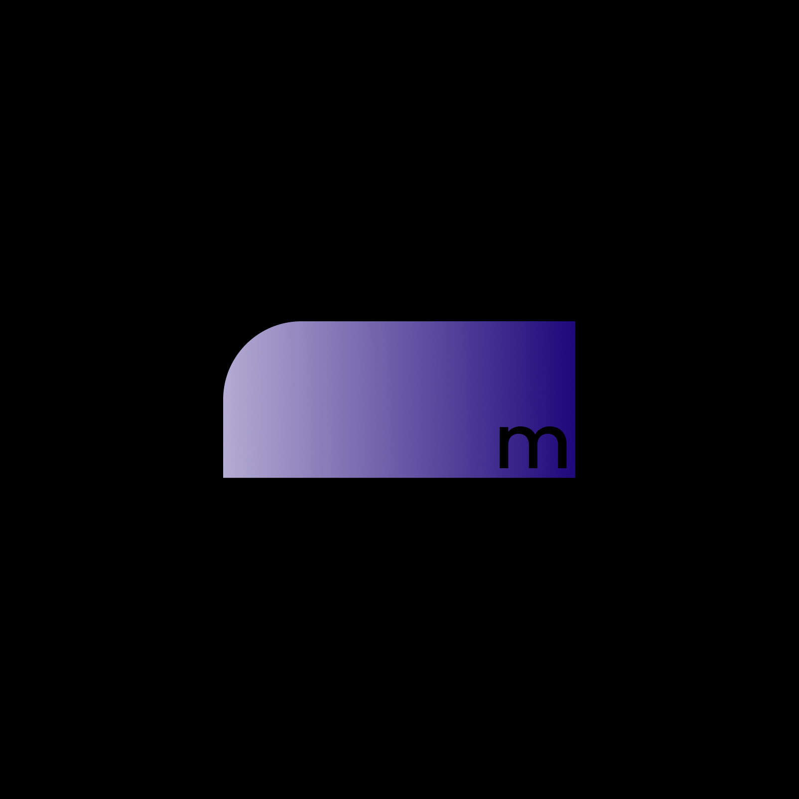

# Rank Cards

Rank cards display user level, XP progress, and rank information. They are one of the most commonly used card types in Discord bots.

<div align="center">



*Stunning rank cards with built-in themes*

</div>

## Table of Contents

- [Overview](#overview)
- [Basic Usage](#basic-usage)
- [Stats Configuration](#stats-configuration)
- [Customization](#customization)
- [Examples](#examples)
- [Styling Options](#styling-options)

---

## Overview

Rank cards provide a visual representation of a user's progress in your Discord server. They typically display:

- User avatar and name
- Current level
- XP progress bar
- Current rank
- Additional stats (total XP, etc.)

---

## Basic Usage

### Creating a Rank Card

```javascript
const { createEngine } = require('modular');

const engine = createEngine();

const rankCard = engine.createRankCard()
  .setUser(user)
  .setStats({
    level: 50,
    xp: 7500,
    maxXp: 10000,
    rank: 5
  });

await rankCard.send(interaction);
```

### With Discord User Object

```javascript
// Using interaction user
const rankCard = engine.createRankCard()
  .setUser(interaction.user)
  .setStats({ level: 50, xp: 7500, maxXp: 10000, rank: 5 });

await rankCard.send(interaction);

// Using guild member
const rankCard = engine.createRankCard()
  .setUser(interaction.member)
  .setGuild(interaction.guild)
  .setStats({ level: 50, xp: 7500, maxXp: 10000, rank: 5 });
```

---

## Stats Configuration

### Required Stats

```typescript
interface RankStats {
  level: number;       // Current level
  xp: number;          // Current XP
  maxXp: number;       // XP needed for next level
  rank?: number;       // Current rank (optional)
}
```

### Extended Stats

```typescript
interface ExtendedRankStats {
  level: number;
  xp: number;
  maxXp: number;
  rank?: number;
  totalXp?: number;    // Total lifetime XP
  previousXp?: number;  // XP at last level
  nextLevelXp?: number; // XP needed for next level
}
```

### Example with Extended Stats

```javascript
const rankCard = engine.createRankCard()
  .setUser(user)
  .setStats({
    level: 50,
    xp: 7500,
    maxXp: 10000,
    rank: 5,
    totalXp: 150000,
    previousXp: 6500,  // XP when reached level 50
    nextLevelXp: 17500 // XP needed for level 51
  });
```

---

## Customization

### Set Progress Color

```javascript
const rankCard = engine.createRankCard()
  .setUser(user)
  .setStats({ level: 50, xp: 7500, maxXp: 10000, rank: 5 })
  .setProgressColor('#ff00ff');
```

### Set Rank Position

```javascript
// Rank badge on the left
card.setRankPosition('left');

// Rank badge on the right
card.setRankPosition('right');

// Rank badge in the center
card.setRankPosition('center');
```

### Show Level Up Animation

```javascript
// Enable level-up animation when user levels up
card.showLevelUpAnimation(true);

// Disable animation
card.showLevelUpAnimation(false);
```

### Set Custom Background

```javascript
// Gradient background
card.setBackground({
  type: 'gradient',
  colors: ['#1a1a2e', '#16213e'],
  direction: 'horizontal'
});

// Image background
card.setBackground({
  type: 'image',
  value: 'https://example.com/bg.jpg',
  opacity: 0.5
});

// Solid color
card.setBackground({
  type: 'color',
  value: '#1a1a2e'
});
```

### Apply Theme

```javascript
// Built-in themes
card.useTheme('cyberpunk');
card.useTheme('neon');
card.useTheme('dark');
card.useTheme('midnight');
card.useTheme('ocean');
card.useTheme('sunset');

// Custom theme
card.useTheme('my-custom-theme');
```

### Custom Tokens

```javascript
card.setTokens({
  'card.background': '#0a0a0a',
  'text.primary': '#ff00ff',
  'text.secondary': '#00ffcc',
  'progress.fill': '#ff00ff',
  'avatar.border': '#ff00ff',
  'card.borderRadius': 16
});
```

---

## Examples

### Basic Rank Card

```javascript
const rankCard = engine.createRankCard()
  .setUser(interaction.user)
  .setStats({
    level: 50,
    xp: 7500,
    maxXp: 10000,
    rank: 5
  })
  .setTheme('cyberpunk');

await rankCard.send(interaction);
```

### Full Featured Rank Card

```javascript
const rankCard = engine.createRankCard()
  .setUser(interaction.user)
  .setGuild(interaction.guild)
  .setStats({
    level: 75,
    xp: 25000,
    maxXp: 30000,
    rank: 3,
    totalXp: 450000
  })
  .setTheme('neon')
  .setProgressColor('#00ffcc')
  .setRankPosition('left')
  .setBackground({
    type: 'gradient',
    colors: ['#1a1a2e', '#16213e'],
    direction: 'horizontal'
  })
  .setTokens({
    'text.fontFamily': 'Montserrat',
    'card.shadow': '0 4px 20px rgba(0, 255, 204, 0.3)'
  });

await rankCard.send(interaction);
```

### Level Up Card

```javascript
function createLevelUpCard(user, newLevel) {
  return engine.createRankCard()
    .setUser(user)
    .setStats({
      level: newLevel,
      xp: 0,
      maxXp: 1000,
      rank: null
    })
    .setTheme('celebration')
    .setBackground({
      type: 'gradient',
      colors: ['#f59e0b', '#ef4444'],
      direction: 'horizontal'
    })
    .showLevelUpAnimation(true);
}

// Usage
const card = createLevelUpCard(user, 50);
await card.send(interaction);
```

### Compare Cards (Two Users)

```javascript
async function compareRanks(interaction, user1, user2) {
  const card1 = engine.createRankCard()
    .setUser(user1)
    .setStats({ level: 75, xp: 25000, maxXp: 30000, rank: 3 })
    .setTheme('cyberpunk');

  const card2 = engine.createRankCard()
    .setUser(user2)
    .setStats({ level: 60, xp: 15000, maxXp: 20000, rank: 8 })
    .setTheme('cyberpunk');

  const buffer1 = await card1.toBuffer();
  const buffer2 = await card2.toBuffer();

  const { AttachmentBuilder } = require('discord.js');
  const attachment1 = new AttachmentBuilder(buffer1, { name: 'rank1.png' });
  const attachment2 = new AttachmentBuilder(buffer2, { name: 'rank2.png' });

  await interaction.reply({
    content: `**Rank Comparison**\n${user1.username} vs ${user2.username}`,
    files: [attachment1, attachment2]
  });
}
```

---

## Styling Options

### Progress Bar Styles

```javascript
// Custom progress color
card.setProgressColor('#ff00ff');

// Custom progress background
card.setTokens({
  'progress.background': 'rgba(255, 255, 255, 0.1)',
  'progress.height': 12,
  'progress.borderRadius': 6
});
```

### Avatar Styles

```javascript
card.setTokens({
  'avatar.size': 80,
  'avatar.border': '#00ffcc',
  'avatar.borderWidth': 4,
  'avatar.shape': 'circle' // 'circle', 'square', 'rounded'
});
```

### Text Styles

```javascript
card.setTokens({
  'text.fontFamily': 'Montserrat',
  'text.fontSize': 16,
  'text.fontWeight': 600,
  'text.primary': '#ffffff',
  'text.secondary': '#b3b3b3',
  'text.muted': '#666666'
});
```

### Card Layout

```javascript
card.setTokens({
  'card.width': 800,
  'card.height': 250,
  'card.background': '#1a1a2e',
  'card.borderRadius': 16,
  'card.shadow': '0 4px 6px rgba(0, 0, 0, 0.3)',
  'card.padding': 20
});
```

---

## Related Documentation

- [API Reference - Rank Card](api-reference.md#rank-card-specific-methods)
- [Theme System](themes.md)
- [Token System](api-reference.md#token-system)
- [Output Guide](output-guide.md)

<div align="center">


*Create beautiful rank cards*

</div>
